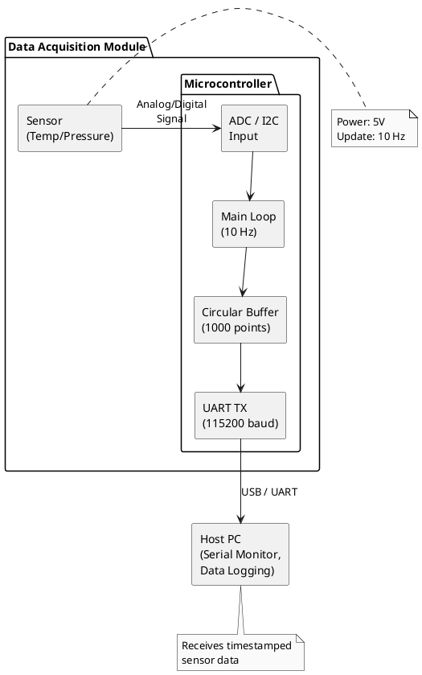

# System Architecture Diagram Instructions

## Current Status

**Text-based diagram:** Available in `01_projectvault/03_architecture_(ARC)/ARC_data_acquisition_example.md` (ASCII art)

**Visual diagram:** Not yet created (requires external tool)

---

## How to Create the Visual Diagram

### Recommended Tools

**Option A: draw.io (Recommended - Free)**
1. Go to https://app.diagrams.net (web-based, no install)
2. Create new diagram
3. Use "Basic Flowchart" or "Block Diagram" template
4. Save as: `system_block_diagram_example.pdf` or `.png`

**Option B: Microsoft PowerPoint/Visio**
1. Open PowerPoint
2. Insert → Shapes → Rectangles, Arrows
3. Export as PDF: File → Export → Create PDF/XPS

**Option C: PlantUML (Code-Generated)**
1. Install PlantUML
2. Use code below (save as `diagram.puml`)
3. Generate PNG: `plantuml diagram.puml`

---

## Diagram Content (Based on Example Module)

### Elements to Include

**Components (Boxes):**
1. Generic Sensor
   - Label: "Sensor (Temp/Pressure/etc.)"
   - Show: VCC, GND, Signal pins

2. Microcontroller
   - Label: "Microcontroller"
   - Show internal blocks:
     - ADC / I2C Input
     - Main Control Loop (10 Hz)
     - Circular Buffer (1000 points)
     - UART Transmitter (115200 baud)

3. Host PC
   - Label: "Host PC"
   - Show functions:
     - Serial Monitor
     - Data Logging
     - Plotting

**Connections (Arrows):**
1. Sensor → Microcontroller: "Analog/Digital Signal (10 Hz)"
2. Microcontroller → Host PC: "USB / UART (115200 baud)"
3. Power supply: "5V" to both sensor and microcontroller

**External Interfaces:**
- Power input (USB or external 5V)
- Sensor input connector

---

## PlantUML Code (Option C)



**To generate:**
```bash
# Install: https://plantuml.com/download
plantuml diagram.puml
# Output: diagram.png
```

---

## Example Block Diagram Layout (Manual Creation)

```
Visual Layout Guide:

┌─────────────────────────────────────────────────────────────┐
│  Title: Data Acquisition System Block Diagram               │
│  Version: 1.0  Date: 2025-01-30                             │
├─────────────────────────────────────────────────────────────┤
│                                                               │
│  ┌────────────┐                                              │
│  │  Sensor    │                                              │
│  │            │                                              │
│  │ VCC  GND   │                                              │
│  │   Signal   │──────────┐                                   │
│  └────────────┘          │ Analog/Digital                    │
│                          │ (0-5V or I2C)                     │
│                          ▼                                    │
│                 ┌─────────────────────────┐                  │
│                 │  Microcontroller        │                  │
│                 │                         │                  │
│                 │  ┌───────────────────┐  │                  │
│                 │  │ ADC / I2C Input   │  │                  │
│                 │  └────────┬──────────┘  │                  │
│                 │           │              │                  │
│                 │  ┌────────▼──────────┐  │                  │
│                 │  │ Main Control Loop │  │                  │
│                 │  │ (Sample at 10 Hz) │  │                  │
│                 │  │ Timestamp data    │  │                  │
│                 │  └────────┬──────────┘  │                  │
│                 │           │              │                  │
│                 │  ┌────────▼──────────┐  │                  │
│                 │  │ Circular Buffer   │  │                  │
│                 │  │ (1000 points)     │  │                  │
│                 │  └────────┬──────────┘  │                  │
│                 │           │              │                  │
│                 │  ┌────────▼──────────┐  │                  │
│                 │  │ UART Transmitter  │  │                  │
│                 │  │ (115200 baud)     │  │                  │
│                 │  └────────┬──────────┘  │                  │
│                 └───────────┼──────────────┘                  │
│                             │ USB                             │
│                             ▼                                  │
│                    ┌─────────────────┐                        │
│                    │    Host PC      │                        │
│                    │  - Serial Mon.  │                        │
│                    │  - Data Logging │                        │
│                    │  - Plotting     │                        │
│                    └─────────────────┘                        │
│                                                               │
│  Legend:                                                      │
│  ──────> : Data flow                                         │
│  ┌────┐ : Component/module                                   │
└─────────────────────────────────────────────────────────────┘
```

Copy this layout into your drawing tool and style as needed.

---

## Styling Recommendations

**Colors (if using color):**
- Sensor: Light blue
- Microcontroller: Light green
- Host PC: Light yellow
- Arrows: Black or dark gray

**Fonts:**
- Title: Bold, 14-16pt
- Component labels: Regular, 10-12pt
- Signal labels: Italic, 8-10pt

**Sizes:**
- Component boxes: ~3cm × 2cm
- Arrow thickness: 1-2pt
- Spacing: 1cm between components

---

## File Naming Convention

Save the diagram as:
- `system_block_diagram_example.pdf` (preferred for documents)
- `system_block_diagram_example.png` (if embedding in markdown)
- `system_block_diagram_example.drawio` (source file if using draw.io)

**Location:** `00_documentation/02_documents/03_architecture_(ARC)/`

---

## Linking the Diagram

Once created, update these files to reference it:

1. **In `system_overview.md`:**
   ```markdown
   ## Visual Overview

   **System Block Diagram:**
   /system_block_diagram_example.pdf)
   ```

2. **In `ARC_data_acquisition_example.md`:**
   ```markdown
   ## System Diagram

   See visual block diagram:
   `02_documents/03_architecture_(ARC)/system_block_diagram_example.pdf`

   (Text-based version shown below for reference)
   ```

---

## Alternative: Use Screenshot

If you prefer:
1. Open the ASCII diagram in `ARC_data_acquisition_example.md`
2. Take a screenshot
3. Annotate with arrows and labels using PowerPoint or Paint
4. Save as PNG

**Advantage:** Quick and easy
**Disadvantage:** Less professional appearance

---

## Notes

**For Template Users:**
- The ASCII diagram in the ARC file is sufficient for demonstration
- Create a professional visual diagram when you build your first real project
- Use the same tool consistently across all modules for uniform appearance

**Tool Recommendation:**
- **draw.io** is free, web-based, and produces high-quality outputs
- Save both the source file (.drawio) and export (PDF/PNG) in the repository
